# Contributing to daisyUI

daisyUI welcomes contributions from anyone willing to help 🤝

## Reporting issues

- Before opening a new issue, first [search for existing issues](https://github.com/saadeghi/daisyui/issues?q=) to avoid duplications.
- Provide detailed reports to make things easier for maintainers.
- If there's a weird bug, please provide a reproduction repository on GitHub (or a [CodePen page](https://daisyui.com/codepen/) or [Tailwind Play](https://daisyui.com/tailwindplay/) page)

## Fixing existing issues

- You can help by [fixing existing issues](https://github.com/saadeghi/daisyui/issues?q=)
- Don't work on issues assigned to others (to avoid duplicate efforts)
- Before starting to work on an issue, please first add a comment and ask to get assigned to that issue. This way everyone will know you're working on that and it avoids duplicate efforts.
- Commit messages must start with: `fix: #1 [description]` which `1` is the number of issue, so the issue will close automatically and it gets added to changelog file on a release.

## Feature requests

- If you have an idea to discuss with the community, please [open a discussion](https://github.com/saadeghi/daisyui/discussions)
- For feature requests, [open a new issue](https://github.com/saadeghi/daisyui/issues/new)
- All feature requests may not fit this library and some may get rejected. Don't take it personally.

## Pull requests

- A pull request must fix [an open issue](https://github.com/saadeghi/daisyui/issues?q=is%3Aissue+is%3Aopen) **assigned to you**. If there's no issue, please create one first. If it's not assigned to you, please ask for it in the comments. This is for avoiding duplicate efforts.
- Fixing typos doesn't need to be an issue. You can just open a pull request.
- Fixing a mistake in document website doesn't need to be an issue. You can just open a pull request.

## Contribute translations

- You can help add or fix translations by using the [Fink localization editor](https://fink.inlang.com/github.com/saadeghi/daisyui?ref=badge)
- Submit the translation by opening a pull request ([see guide](https://inlang.com/g/6ddyhpoi/guide-nilsjacobsen-contributeTranslationsWithFink))

## Building on local

### To build the daisyUI node package on local:

1. [[Fork](https://github.com/saadeghi/daisyui/fork) and] clone the repo on local – only fork the master branch
2. [Install Bun](https://bun.sh/) if you don't have it:
3. Install dependencies:
  ```
  bun install
  ```
4. Build daisyUI package:
  ```
  bun run build
  ```
5. Now you can use your local build of daisyUI in another local project by installing it as a dependency using Bun (or NPM, etc):  
  In your own local project where you want to use daisyUI:
  ```
  bun install /path/to/daisyui/packages/daisyui
  ```

### To run the [documentation site](https://daisyui.com/) on local:

1. [[Fork](https://github.com/saadeghi/daisyui/fork) and] clone the repo on local – only fork the master branch
2. [Install Bun](https://bun.sh/) if you don't have it:
3. Install dependencies:
  ```
  bun install
  ```
4. Build daisyUI package:
  ```
  bun run build
  ```
5. Run the document site:
  ```
  bun run dev
  ```

### File structure

```js
packages
├── daisyui //daisyUI package
│   ├── index.js //entry point
│   ├── functions
│   ├── src
│   │   ├── base
│   │   ├── components
│   │   ├── themes
│   │   ╰── utilities
│   ╰── // generated files
├── docs //documentation site
│   ╰── src
│       ├── routes
│       │   ╰── (routes)
│       │       ├── blog
│       │       ├── components //component docs
│       │       ├── docs //docs
│       │       ╰── ...
│       ╰── translations
╰── playground //playground site
    ╰── src
        ╰── components
            ╰── Component.astro // Where you can test things without committing
```

### packages/daisyui workflow

```mermaid
---
title: daisyUI build flow
---
graph TD

    subgraph Build["src/"]
        E[Themes]
        F[base]
        G[components]
        H[utilities]
    end

    Build


    Build



    subgraph FinalPackage["components/"]

        E
        E
        E
        F
        F
        F
        G
        J12[components/*.css]
        G
        J13[components/*/index.js]
        G
        J14[components/*/object.js]
        G
        J15["*/class.json"]
        H
        H
        H
    end

    FinalPackage
	J13
	J12
	J12
	subgraph s1["CSS"]
		J2["daisyui.css - CDN"]
		J3["themes.css"]
		J4["chunks.css"]
	end
	J4
	J12 --- J4
	J4
	J4
	J4
	J3
	J12["*.css"] --- J2
	J2
	J2
	J2
	J2
	J2
	subgraph s2["@plugin "daisyui""]
		J19["import.js"]
		J1["index.js - Plugin"]
	end
	J1
	J19
	J19
	J19
	J13 --- J19
	J19 --- J1["index.js"]
	subgraph s3["utilities/"]
		J16["utilities/*.css"]
		J17["utilities/*/index.js"]
		J18["utilities/*/object.js"]
	end
	H
	J18["*/object.js"]
	J17 --- J19
	H
	J17["*/index.js"]
	J16 --- J2
	J16 --- J4
	H
	J16["*.css"]
	subgraph s4["base/"]
		J11["base/*/object.js"]
		J9["base/*.css"]
		J10["base/*/index.js"]
	end
	subgraph s5["colors/"]
		J5["colors/*.css"]
	end
	subgraph s6["themes/"]
		J6["theme/*.css"]
		J8["theme/*/object.js"]
		J7["theme/*/index.js"]
	end
	J10 --- J19
	F
	J10
	J9 --- J2
	J9 --- J4
	F
	J9["*.css"]
	F
	J11
	J7 --- J19["imports.js"]
	E
	J7
	E
	J8
	J6 --- J2
	J6 --- J3
	J6 --- J4
	E["themes"]
	J6["*.css"]
	J5 --- J2["daisyui.css"]
	J5 --- J4
	J5
	J8["*/object.js"] --- J7["*/index.js"]
	J14["*/object.js"] --- J13["*/index.js"]
	J11["*/object.js"] --- J10["*/index.js"]
	J5
	J18 --- J17
	subgraph s7["build"]
		n3@{ label: "Rectangle" }
	end
	Build
	J5
	s7
	s5
	subgraph s8["functions/"]
		n10["...other build functions"]
		D["functions/variables.css"]
		n8["variables.js"]
		n7["themeOrder.js"]
		n6["pluginOptionsHandler.js"]
		n5["plugin.js"]
		n4["addPrefix.js"]
		n1["themePlugin.js"]
	end
	n1
	H["utilities/*.css"] --- s3
	G["components/*.css"] --- FinalPackage
	F["base/*.css"] --- s4
	E["themes/*.css"] --- s6
	n3@{ shape: "flip-tri", label: "build.js" } --- Build
	n4 --- J1
	n8 --- J1
	n5 --- J1
	n6 --- J1
	n7 --- n6
	subgraph s9["@plugin "daisyui/theme""]
		n2["theme/index.js"]
		n9["/object.js"]
	end
	n1 --- n2["/index.js"]
	J8 --- n9
	D["variables.css"] --> J5["*.css"]
	style J1 fill:#FFDE59,color:#000000
	style n2 color:#000000,fill:#FFDE59
	n5 --- n1
	n9 --- n1
	n4
	J7
	n4 --- J17
	n4 --- J10
	n4 --- J13
	style J12 fill:#5E17EB,color:#FFFFFF
	style J16 fill:#5E17EB,color:#FFFFFF
	style J9 fill:#5E17EB,color:#FFFFFF
	style J5 fill:#5E17EB,color:#FFFFFF
	style J6 fill:#5E17EB,color:#FFFFFF
	style J3 fill:#5E17EB,color:#FFFFFF
	style J2 fill:#5E17EB,color:#FFFFFF
	style J4 fill:#5E17EB,color:#FFFFFF
```


